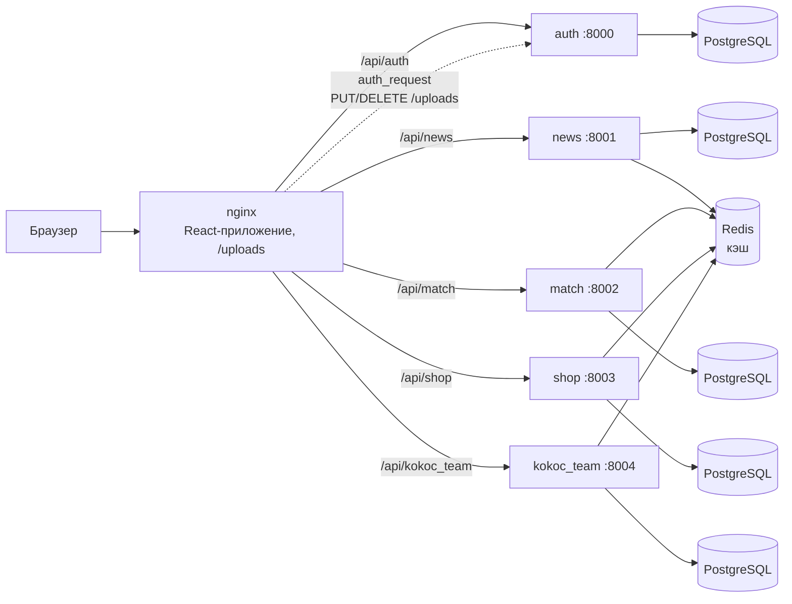

# ФК «Кокос» — платформа для клуба и болельщиков

Веб-платформа футбольного клуба «Кокос»: новости, матчи с видеозаписями, состав команды, магазин атрибутики с корзиной
и админка для контента. Сделана командой из четырёх человек на хакатоне в октябре 2024: React + TypeScript на клиенте,
пять микросервисов на Django REST Framework, всё запускается одной командой через Docker Compose.


<!-- demo: перетащите GIF в редактор README на GitHub — он загрузится в user-attachments, а не в репозиторий -->

## Возможности

**Для болельщиков**
- Новости клуба с поиском, календарь и результаты матчей с видеозаписями, состав команды и статистика игроков.
- Магазин: товары по размерам, корзина с учётом остатков на складе.
- Регистрация с подтверждением email по коду, личный кабинет с аватаром.

**Для администратора** (`/admin`)
- Создание и редактирование новостей, матчей, игроков, товаров и информации о клубе.
- Загрузка изображений прямо из админки; изменения видны на сайте сразу.

## Архитектура



- **nginx** отдаёт собранный клиент, проксирует `/api/*` в нужный сервис и хранит загруженные изображения в томе `uploads`.
- **auth** — пользователи и JWT. Access-токен (30 минут) хранится в клиенте, refresh-токен (60 дней) — в httpOnly cookie
  и в базе, поэтому выход из аккаунта действительно завершает сессию.
- Остальные сервисы не ходят в auth: они проверяют подпись JWT общим ключом `JWT_SIGNING_KEY` и берут из токена
  `user_id` и признак администратора `is_superuser`.
- У каждого сервиса своя база PostgreSQL. Списки кэшируются в Redis на 20 минут, а после любого изменения данных
  кэш сервиса сбрасывается.
- **Загрузка изображений**: клиент кладёт файл методом `PUT` в `/uploads/<папка>/…`, nginx перед сохранением спрашивает
  auth-сервис (`auth_request`). Администратор может загружать во все папки, пользователь — только свой аватар; принимаются
  только изображения до 10 МБ.

## Быстрый старт

Нужны Docker и Docker Compose.

```bash
cp .env.example .env
docker compose up --build
```

Сайт откроется на http://localhost:8080 (порт меняется переменной `WEB_PORT`).

Создать администратора:

```bash
docker compose exec auth_microservice python manage.py createsuperuser
```

После входа администратор попадает в `/admin`.

**Код подтверждения при регистрации.** Если в `.env` не задан SMTP (`EMAIL_HOST_AUTH`), письма не отправляются,
а печатаются в лог auth-сервиса:

```bash
docker compose logs auth_microservice | grep "код подтверждения"
```

Для настоящей отправки укажите `EMAIL_HOST_AUTH`, `EMAIL_HOST_USER_AUTH` и `EMAIL_HOST_PASSWORD_AUTH`
(например, пароль приложения mail.ru или Яндекса).

**HTTPS (необязательно).** Положите в `client/certificates/` сертификаты `localhost.pem` и `localhost-key.pem`
(например, из [mkcert](https://github.com/FiloSottile/mkcert): `mkcert -install && mkcert localhost`) и перезапустите
`frontend` — nginx включит HTTPS на порту `WEB_HTTPS_PORT` (по умолчанию https://localhost:8443).
Для работы через HTTPS установите `REFRESH_COOKIE_SECURE=True`.

## Сервисы и API

| Сервис | Порт | Префикс | Что делает |
|---|---|---|---|
| auth_microservice | 8000 | `/api/auth/` | `verify-email/`, `signup/`, `login/`, `refresh/`, `logout/`, `profile/get_user_data/`, `profile/update/` |
| news_microservice | 8001 | `/api/news/` | `get_all/`, `<id>/`, `create/`, `<id>/update/`, `<id>/delete/` |
| match_microservice | 8002 | `/api/match/` | `get_all/`, `get_by_id/<id>/`, `get_last/`, `get_last_three/`, `get_next/`, `get_upcoming/`, `create/`, `update/<id>/`, `delete/<id>/` |
| shop_microservice | 8003 | `/api/shop/` | `get_all/`, `<id>/`, `create_product/`, `update_product/<id>/`, `delete_product/<id>/`, `add_to_cart/`, `get_all_items_from_cart/`, `remove_item_from_cart/<id>/` |
| kokoc_team_microservice | 8004 | `/api/kokoc_team/` | `get_all_players/`, `get_player/<id>/`, `create_player/`, `update_player/<id>/`, `delete_player/<id>/`, `get_info_club/`, `info_club/update/` |

Создание, изменение и удаление — только для администратора (`Authorization: Bearer <access>`), чтение открыто.
Интерактивная документация Swagger у каждого сервиса: `http://localhost:<порт>/swagger/`.
В [`docs/api/`](docs/api) лежат выгрузки схем на момент хакатона.

**Регистрация** проходит в два шага:

```http
POST /api/auth/verify-email/   {"email": "fan@example.com", "username": "fan"}
POST /api/auth/signup/         {"email": "fan@example.com", "username": "fan", "password": "…", "code": "123456"}
```

Код приходит только на почту, действует 10 минут и даёт 5 попыток; повторно запросить его можно раз в минуту.

## Переменные окружения

Все переменные с комментариями — в [`.env.example`](.env.example). Главные:

| Переменная | Назначение |
|---|---|
| `SECRET_KEY_<СЕРВИС>` | Django `SECRET_KEY` каждого сервиса |
| `JWT_SIGNING_KEY` | общий ключ подписи JWT для всех сервисов |
| `DATABASE_{NAME,USER,PASSWORD,HOST,PORT}_<СЕРВИС>` | подключение к базе сервиса |
| `EMAIL_*_AUTH` | SMTP для писем с кодом; пусто — письма в лог |
| `DJANGO_DEBUG` | режим отладки Django, по умолчанию выключен |
| `WEB_PORT`, `WEB_HTTPS_PORT` | порты сайта на машине |
| `REFRESH_COOKIE_SECURE` | отправлять refresh-cookie только по HTTPS |

## Тесты

```bash
docker compose exec auth_microservice python manage.py test auth_microservice_app
docker compose exec news_microservice python manage.py test news_microservice_app
docker compose exec shop_microservice python manage.py test shop_microservice_app
docker compose exec match_microservice python manage.py test match_microservice_app
docker compose exec kokoc_team_microservice python manage.py test kokoc_team_microservice_app
```

Проверяются регистрация с кодом, вход и выход, права на загрузку файлов, доступ администратора,
сброс кэша после изменений и остатки в корзине.

## Структура проекта

```
client/                       React + TypeScript (webpack), MobX, MUI
  nginx/                      конфигурация nginx: маршруты, прокси, загрузка файлов, HTTPS
  src/api/                    HTTP-клиенты, сервисы и store (MobX)
  src/pages/                  страницы сайта и админки
server/
  Dockerfile                  общий образ для всех сервисов (gunicorn)
  requirements.txt            зависимости всех сервисов
  common/                     общие настройки Django, проверка прав администратора, сброс кэша
  auth_microservice/          пользователи, JWT, коды подтверждения, проверка загрузок
  news_microservice/          новости
  match_microservice/         матчи
  shop_microservice/          товары, размеры, корзина
  kokoc_team_microservice/    игроки и информация о клубе
docs/api/                     выгрузки Swagger
docker-compose.yml            5 сервисов, 5 баз PostgreSQL, Redis, nginx
```

## Разработка без Docker

Сервис можно запустить локально, если PostgreSQL и Redis доступны на машине (`DATABASE_HOST_*` и `REDIS_URL` в `.env`):

```bash
python -m venv .venv && . .venv/bin/activate
pip install -r server/requirements.txt
cd server/news_microservice
python manage.py migrate && python manage.py runserver 8001
```

Клиент собирается в `client/dist/`:

```bash
cd client && npm ci && npm run build
```

## Ограничения

- Оформление заказа не реализовано: корзина есть, оплаты и заказов нет.
- Клиентский бандл большой (около 7 МБ): картинки и библиотеки не разбиты на части.
- Access-токен хранится в `localStorage`.
- Каждый сервис — отдельная база и отдельный контейнер: для такого масштаба это избыточно, но так задумана
  микросервисная архитектура хакатона.

## Авторы

- **Дмитрий** ([@1abobik1](https://github.com/1abobik1)) — бэкенд
- **Максим** ([@Conopi](https://github.com/Conopi)) — бэкенд
- **Вячеслав** ([@Juryxa](https://github.com/Juryxa)) — фронтенд
- **Михаил** ([@mannco1](https://github.com/mannco1)) — фронтенд
